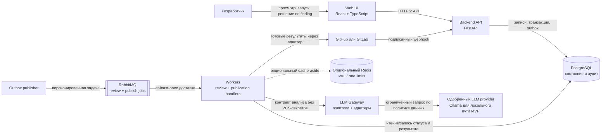
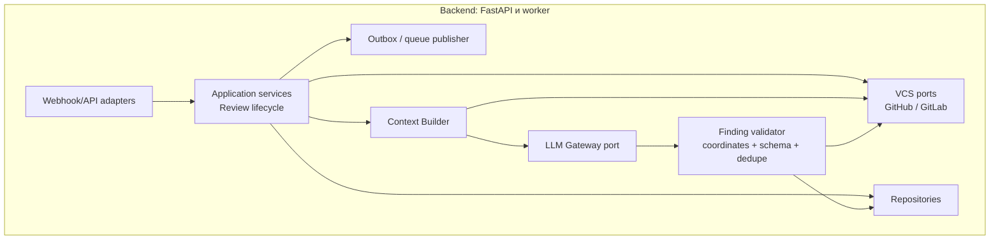

# System Design: AI Code Reviewer

| Поле | Значение |
|---|---|
| Проект | DMC-268 UI, команда 5 |
| Статус | Черновик для командного утверждения; решения и стартовые SLO требуют валидации |
| Область | MVP: веб-интерфейс, API, асинхронный анализ изменений, GitHub/GitLab и LLM gateway |
| Источник требований | `main.md`; продуктовые параметры, не определённые в задании, перечислены в разделе «Открытые решения» |

## 1. Цель и границы

Система принимает событие о Pull Request / Merge Request или запрос на проверку diff, получает изменения по неизменяемым SHA, собирает ограниченный контекст, запускает анализ через LLM, валидирует замечания и показывает их в веб-интерфейсе. Публикация в VCS выполняется отдельным адаптером и подчиняется политике репозитория.

Основной принцип: LLM предлагает кандидатов на замечания, но не является источником истины. Backend проверяет структуру ответа, существование файла и координаты в diff, выполняет дедупликацию и только после этого сохраняет и/или публикует результат.

Триггеры нормализуются в общий контракт: автоматический запуск при открытии/обновлении PR/MR, ручной запуск из Web UI/API, platform quick action/slash command, mention и ответ в review thread. Последний тип создаёт follow-up к исходному review, а не новую независимую проверку. Набор включённых триггеров задаётся политикой installation/repository и возможностями VCS adapter; детали команд GitLab/GitHub не входят в доменную модель.

Вне MVP, пока команда не согласовала обратное: обучение собственной foundation model, индексирование всего репозитория, полноценный IDE-плагин, гарантии точности модели и автоматическое блокирование merge по результату LLM.

## 2. Контейнерная архитектура (C4, уровень контейнеров)



Backend API и consumers могут быть одним Python-пакетом и разными процессами/контейнерами. Review и publication handlers масштабируются независимо; публикация получает отдельные queue messages и не блокирует завершение анализа. Web UI не обращается напрямую к VCS, очереди или LLM.

### Компоненты backend



| Компонент | Ответственность | Не отвечает за |
|---|---|---|
| Web UI | Просмотр MR/diff/findings, фильтры, статусы, запуск/повтор проверки, решение пользователя | Секреты провайдеров, непосредственные API вызовы VCS/LLM, оркестрацию фоновых задач |
| Backend API | Авторизация, webhook, команды UI, чтение состояния, запись переходов и outbox | Длительное ожидание LLM в HTTP-запросе |
| VCS adapter | Нормализация событий и API GitHub/GitLab; получение diff/файлов; публикация статуса и комментариев | Бизнес-правила review и LLM prompt |
| Context Builder | Фильтрация, разбиение на части, сбор четырёх уровней контекста и учёт бюджета | Решение о публикации результата |
| Review worker | Получение задачи, оркестрация сборки/анализа/валидации, повторы и сохранение статусов | Владение долговечным состоянием вне PostgreSQL |
| LLM Gateway | Провайдер-независимый контракт, лимиты, timeout, метаданные модели и политики обработки данных | Хранение VCS credential или принятие непроверенного вывода как истины |
| PostgreSQL | Источник истины для установок, проверок, findings, попыток, публикаций и аудита | Транспорт очереди |
| RabbitMQ | Буферизация и доставка асинхронных задач | Единственное долговечное бизнес-состояние |

## 3. Поток данных

```mermaid
sequenceDiagram
    autonumber
    participant VCS as GitHub/GitLab
    participant API as Backend API
    participant DB as PostgreSQL
    participant Q as RabbitMQ
    participant W as Review worker
    participant P as Publication worker
    participant C as Context Builder
    participant L as LLM Gateway
    participant UI as Web UI

    VCS->>API: Webhook (signature, delivery ID, MR/PR, head SHA)
    API->>API: Проверить подпись, installation и событие
    API->>DB: Транзакция: dedupe delivery, создать ReviewJob + Outbox
    API-->>VCS: 2xx после durable commit
    DB-->>Q: Outbox publisher отправляет ReviewRequested.v1
    Q->>W: Доставка задачи (at-least-once)
    W->>DB: Claim job / записать попытку
    W->>C: Собрать diff и ограниченный контекст для base/head SHA
    C->>VCS: Получить diff и разрешённые файлы по SHA
    C-->>W: ContextBundle + budget metadata
    W->>L: Анализ ограниченных частей
    L-->>W: Структурированный список кандидатов
    W->>W: Проверить schema, commit, путь, координаты, дубли
    W->>DB: Сохранить findings; завершить review job
    alt Policy разрешает auto-publish
      W->>DB: Создать PublicationOperation + outbox
    else draft_only
      W->>DB: Отметить findings как ready_for_review
      opt Пользователь позже одобряет выбранные findings
        UI->>API: Одобрить публикацию выбранных findings
        API->>DB: Проверить права; создать PublicationOperation + outbox
      end
    end
    opt PublicationOperation создана
      DB-->>Q: PublishArtifact.v1
      Q->>P: Доставка publication operation
      P->>DB: Захватить operation (lease/CAS)
      P->>VCS: Найти публикацию с тем же marker
      alt Объект уже существует
        VCS-->>P: Существующий provider object ID
      else Объект не найден после reconciliation
        P->>VCS: Создать артефакт с тем же стабильным marker
        VCS-->>P: Provider object ID или неоднозначный timeout
      end
      P->>DB: Сохранить receipt либо отметить outcome unknown
    end
    UI->>API: Получить статус / findings
    API->>DB: Чтение актуального состояния
    DB-->>API: Job + findings
    API-->>UI: API response
```

Для on-demand запуска UI вызывает API; после авторизации путь присоединяется к созданию ReviewJob + Outbox. HTTP возвращает `202 Accepted` с `review_id`, не ожидая ответа модели. Обновление UI выполняется опросом статуса; streaming/SSE можно добавить отдельно, если polling окажется недостаточен.

## 4. Жизненный цикл проверки и хранение

Предлагаемые состояния ReviewJob: `queued -> collecting_context -> analyzing -> validating -> completed`. Терминальные состояния: `failed`, `cancelled`, `stale`. ReviewJob завершается независимо от публикации. Агрегатный `PublicationStatus`: `not_requested` (draft-only до approval), `pending`, `publishing`, `published`, `unknown`, `needs_manual_reconciliation` или `failed`. В draft-only findings остаются `ready_for_review`, а PublicationOperation не создаётся до явного approval; lifecycle конкретной операции начинается с `pending`. UI показывает статус review и публикации отдельно. Повторная доставка сообщения не должна создавать новую проверку.

Основные сущности:

- `Installation`: провайдер, внешний installation/project ID, зашифрованная ссылка на секрет, разрешённые репозитории.
- `Review`: provider, repository, PR/MR ID, base SHA, head SHA, инициатор, policy snapshot, статус и временные метки.
- `ReviewJob`: review ID, `kind` (`full`/`follow_up`), idempotency key, состояние, номер попытки, lease/heartbeat, последняя ошибка; follow-up дополнительно хранит `parent_review_id` и source comment/thread ID.
- `ContextManifest`: версия политики контекста, использованные уровни, исключённые/усечённые файлы, оценки размера; по умолчанию без полного текста файлов.
- `Finding`: стабильный fingerprint, путь, сторона/диапазон строк, severity, category, сообщение, предложение, confidence, статус.
- `PublicationOperation`: уникальный `idempotency_key`, тип артефакта, review/head SHA, fingerprint или summary version, provider marker, состояние, lease, request hash, provider object ID и временные метки. Попытки/ответы аудируются отдельно; одна логическая операция сохраняет один ключ между повторами.
- `OutboxEvent`: сериализованное событие для доставки в RabbitMQ и статус отправки.

Состояние модели фиксируется в review: `provider`, `model`, `prompt_version`, `schema_version`; секреты и полный prompt в обычные логи не записываются.

## 5. VCS: взаимодействие и контракты

1. Поддерживать GitHub и GitLab за единым внутренним контрактом `VCSAdapter`; платформенные имена событий, quick actions, форматы координат и синтаксис suggestion не протекают в UI или доменные сервисы.
2. Нормализовать открытие/обновление PR/MR, UI/API запуск, команды, mentions и ответы в review thread в типизированные события. Проверять подпись webhook до обработки тела как команды, installation/project permissions и допустимость действия. Секреты webhook различаются по installation/project.
3. Дедуплицировать webhook по provider + delivery ID, comment-trigger по provider comment ID, ручной запуск по idempotency key из repo, PR/MR, head SHA и request identity. Ответ в треде должен ссылаться на исходные review/finding/thread и проходить авторизацию автора.
4. Review привязан к неизменяемым `base_sha` и `head_sha`. Diff и содержимое файлов получать именно для них; перед публикацией сверять актуальный head. Если head изменился, пометить старую задачу `stale`, не публиковать её результат и, если включён automatic-update trigger, создать/дедуплицировать новый ReviewJob для нового SHA. Завершить старую задачу как stale без обработки нового события недостаточно.
5. Внутреннее finding хранит `path`, `old_line?`, `new_line?`, диапазон, сторону и SHA. Adapter преобразует их в GitHub diff position / GitLab discussion position; mapping покрывается контрактными тестами. Нельзя подменять diff position абсолютным номером строки.
6. Публикация выполняется отдельными durable-операциями для summary, каждой inline discussion и статуса проверки. Частичный успех не повторяет уже подтверждённые артефакты; детали протокола — ниже. Finding может включать структурированное предложение `{replacement, start_line, end_line}`; VCS adapter проверяет диапазон и форматирует предложение средствами платформы, а при несовместимости публикует обычный комментарий без предложения.
7. Токены VCS минимально привилегированы и остаются на сервере. LLM получает код и метаданные, но не VCS credential, webhook secret или пользовательский access token.
8. Автопубликация настраивается per repository. Предложение до утверждения политики: режим по умолчанию `draft_only`; findings остаются `ready_for_review`, PublicationOperation не создаётся до явного одобрения пользователем. Автоматическая публикация включается только явно после проверки качества/прав доступа.
9. Ответ в review thread создаёт ограниченный follow-up, связанный с исходным review и finding. В контекст включаются только доступные пользователю сообщения этой ветки и относящиеся к ним findings; весь MR conversation не загружается по умолчанию. Follow-up не запускает повторную полную проверку, если пользователь явно этого не запросил.

Поток follow-up: VCS comment/reply event проходит ту же проверку подписи, dedupe и авторизации; adapter нормализует его в `ReviewRequested.v1` с `kind=follow_up`, backend сохраняет ссылку на исходный review/thread и outbox event, worker получает разрешённый snapshot ветки и отправляет его через тот же Context Builder/LLM Gateway. Исходный текст рассматривается как недоверенные инструкции. Полный текст треда не сохраняется дольше установленной retention policy.

### Идемпотентная публикация

Exactly-once между PostgreSQL и внешним VCS API недостижима без общей транзакции или гарантированной idempotency key поддержки со стороны провайдера. Система обеспечивает effectively-once только при успешной reconciliation; неоднозначный результат никогда не повторяется вслепую.

1. Перед сетевым вызовом транзакционно создать `PublicationOperation` и outbox-событие `PublishArtifact.v1`. На `(provider, installation_id, repository_id, idempotency_key)` действует unique constraint; конкурентные/повторные события получают ту же операцию.
2. Стабильный ключ вычислять из канонического набора: provider, installation, repository, PR/MR, head SHA, тип артефакта и finding fingerprint. Для summary/status использовать стабильный artifact key и версию содержимого. Номер попытки и время запроса в ключ не включать. У каждого inline finding свой ключ.
3. Worker захватывает операцию через lease/CAS и перед create сначала выполняет provider-specific reconciliation по marker. Marker должен сохраняться и находиться через API конкретной платформы; adapter contract tests обязаны проверить round-trip. Если API не даёт надёжно искать marker, это ограничение фиксируется для провайдера и автоматический retry после ambiguous outcome запрещён.
4. При создании передавать тот же marker для каждого retry. Хранить request hash и внешний object ID. Найденный объект привязать к операции и перевести её в `published`; успешный повтор не создаёт новый комментарий.
5. Таймаут, обрыв соединения после отправки или падение worker до сохранения provider object ID переводят операцию в `unknown`, а не в обычный retryable failure. После lease expiry первым действием всегда остаётся reconciliation. Если объект найден — фиксировать его ID и успех; если отсутствие подтверждено с учётом окна видимости API — повторять создание с тем же marker.
6. Если отсутствие объекта нельзя доказать (например, API не поддерживает поиск marker или результат остаётся неоднозначным), переводить операцию в `needs_manual_reconciliation`, поднимать alert и не создавать новый артефакт автоматически. UI/API должны показывать частичный результат и статус публикации.
7. Повторять автоматически только ошибки, для которых adapter может доказать, что провайдер не принял создание (например, rate limit до обработки с `Retry-After`). 5xx/сетевые ошибки считать ambiguous, если контракт провайдера не гарантирует отсутствие side effect. Постоянные 4xx отправлять в terminal failure с причиной.
8. Перед отправкой и перед reconciliation проверять актуальность head SHA и право установки. Stale operation не публиковать; новый head получает новые operation keys. Summary, inline discussions и check/status имеют независимые состояния, поэтому повтор после частичного успеха затрагивает только незавершённые операции.

## 6. Очередь задач

### Рекомендация

Для первого надёжного контура использовать RabbitMQ как транспорт, PostgreSQL как источник истины и небольшой адаптер очереди в backend. Прямой consumer достаточен для MVP. Celery допустим, если команда выберет его ради готовых Python worker/retry-инструментов, но состояние review и гарантии идемпотентности всё равно остаются явными в PostgreSQL. Не запускать Redis Streams как вторую очередь параллельно RabbitMQ без отдельной причины и модели восстановления.

### Сообщение `ReviewRequested.v1`

Сообщение содержит ссылки и версии, а не исходный код или секреты:

```json
{
  "event_id": "uuid",
  "event_type": "ReviewRequested",
  "schema_version": 1,
  "occurred_at": "RFC3339 timestamp",
  "review_id": "uuid",
  "job_id": "uuid",
  "kind": "full | follow_up",
  "idempotency_key": "sha256 digest",
  "provider": "github | gitlab",
  "repository_id": "provider-scoped id",
  "pull_request_id": "provider-scoped id",
  "base_sha": "commit sha",
  "head_sha": "commit sha",
  "trigger": "automatic_open | automatic_update | manual_ui | quick_action | mention | thread_reply",
  "source_event_id": "provider webhook delivery ID or null",
  "source_comment_id": "provider comment ID or null",
  "source_thread_id": "provider thread ID or null",
  "parent_review_id": "uuid or null",
  "trace_id": "uuid"
}
```

- Delivery semantics: at-least-once; обработчик обязан быть идемпотентным.
- Создание job и outbox выполняется в одной DB-транзакции; отдельный publisher отправляет неподтверждённые outbox события. Это закрывает окно потери между commit PostgreSQL и publish в брокер.
- Consumer подтверждает сообщение после сохранения результата/терминального перехода. На временной ошибке — ограниченный retry с exponential backoff + jitter; после лимита — DLQ с alert и возможностью контролируемого replay.
- Ошибка схемы/неподдерживаемый event version не должна бесконечно повторяться: quarantine/DLQ и диагностика.
- Ограничить prefetch/число параллельных вызовов по лимитам VCS и LLM. Heartbeat/lease позволяет обнаружить зависший worker; повтор не создаёт второго активного job для того же idempotency key.
- Запрещено помещать исходный код, prompt, токены или PII в заголовки/логи сообщений.

### Сообщение `PublishArtifact.v1`

Сообщение содержит ссылку на уже сохранённую операцию, а не тело комментария или секреты. `operation_id` и `idempotency_key` указывают на одну и ту же логическую публикацию при всех повторных доставках:

```json
{
  "event_id": "uuid",
  "event_type": "PublishArtifact",
  "schema_version": 1,
  "operation_id": "uuid",
  "idempotency_key": "sha256 digest",
  "review_id": "uuid",
  "head_sha": "commit sha",
  "artifact_type": "summary | inline_finding | check_status",
  "trace_id": "uuid"
}
```

## 7. Стратегия кэширования контекста

Начать с cache-aside и выключаемого Redis-адаптера. Кэш — оптимизация, не источник истины. На первом этапе разрешить кэшировать результаты получения immutable diff/file content только при подтверждённых правах и политике хранения. Не кэшировать ответы LLM без измеримой выгоды и стратегии инвалидирования.

Ключ кэша вычислять как хеш канонической структуры:

`tenant_id | provider | repository_id | base_sha | head_sha | path | context_policy_version | parser_version | project_rules_digest | review_metadata_digest | feedback_snapshot_id`

Правила:

- Разделять namespace между tenant/installation; проверять разрешения до cache hit, чтобы кэш не обходил авторизацию.
- Изменение SHA, версии сборщика/parser/policy, правил репозитория, MR metadata или снимка существующих комментариев формирует новый ключ; для неизменяемых объектов явная инвалидизация при новом commit не нужна.
- Хранить только необходимое, шифровать в покое и ограничивать TTL. Стартовое предложение для временного кэша контента: максимум 24 часа; значение требует одобрения retention-политики.
- Поддержать удаление по tenant/repository и запрет кэширования для репозиториев с более строгой политикой.
- Redis, если включён, используется для короткоживущих кэш-записей, rate limits и distributed locks с TTL. Очередь остаётся RabbitMQ. При недоступности кэша система продолжает работу с деградацией производительности.
- До утверждения требований к размещению/удалению данных не сохранять целые файлы в постоянном хранилище и не отправлять их неутверждённому hosted LLM.

## 8. Context Builder: четыре уровня

Контракт верхнего уровня `ContextBundle` версионируется и включает `review_id`, provider/repository/MR IDs, base/head SHA, язык, режим redaction, лимит токенов, список chunks, manifest и `feedback_snapshot_id`. Отдельный `ReviewIntent` содержит title, description, labels и выбранные commit messages; `ProjectRules` — нормализованные правила и digest/version; `ExistingFeedback` — ограниченный snapshot релевантных review comments/discussions с provider IDs, путями, line ranges и состоянием. `review_metadata_digest` и `feedback_snapshot_id` меняются при обновлении title/description/labels/commit messages или доступных комментариев, даже если head SHA не изменился. Метаданные и feedback передаются как недоверенные данные, не как системные инструкции. Каждый элемент контекста содержит источник, путь, диапазон строк, SHA содержимого, encoding/language и число оценочных токенов. Контент передаётся модели только после проверки прав, фильтрации секретов/исключённых путей и бюджета.

| Уровень | Данные | Когда включать |
|---|---|---|
| 1. Diff | Для каждого файла: `path`, `change_type`, `base_sha`, `head_sha`, unified hunks, context/add/delete строки с `old_line`/`new_line`, изменённые диапазоны, язык. Исключать бинарные/сгенерированные файлы и пути из нормализованных repository ignore rules | Всегда; основной предмет ревью |
| 2. Surrounding | Ограниченные окна до/после изменённых диапазонов из head-файла, при необходимости base-версии для удалённых строк; точные start/end lines, связь с hunk, причина включения. Добавлять содержащую функцию/класс, если парсер определил её и бюджет позволяет | Начальное окно: 30 строк с каждой стороны; адаптивно расширять до 100 строк или до границ содержащего symbol, только в пределах бюджета |
| 3. Whole File | Полное содержимое небольшого изменённого текстового файла head-версии с номерами строк и маской изменённых диапазонов; для удаления — base-версия с явным указанием стороны | Только если файл мал и целиком полезен; не включать автоматически крупные файлы |
| 4. AST / Imports | Изменённые symbol IDs/имена, kind, signature, диапазон определения; import edges и ограниченные определения непосредственно используемых символов; язык/версия parser/грамматики и confidence | Выборочно, если локальные уровни не объясняют тип/контракт. Tree-sitter даёт синтаксическую структуру, но не заменяет type checker/семантический индекс |

Сборщик работает в порядке `Diff -> Surrounding -> Whole File -> AST/Imports`, но решение об уровнях зависит от бюджета и достаточности локального контекста. В MVP предпочтительны выборочные импорты/определения, а не индекс всего репозитория. Ignore rules нормализуются из платформенной конфигурации и правил репозитория (например, `.gitlab/duo-ignore` только как вход адаптера, а не внутренний формат); конфликт правил разрешается по явно заданной precedence и отражается в manifest. Все части сохраняют происхождение и координаты; нельзя смешивать строки base/head без явного `side`. Для большого diff разбивать по файлам и hunks, приоритизировать исходный код над generated/docs/config, однако не терять неизменённые файлы молча: записывать причину skip/truncation в manifest.

### Структуры одного элемента

```json
{
  "diff_file": {
    "path": "src/service.ts",
    "change_type": "modified",
    "base_sha": "...",
    "head_sha": "...",
    "hunks": [{
      "header": "@@ -10,2 +10,3 @@",
      "lines": [
        {"kind": "context", "old_line": 10, "new_line": 10, "text": "..."},
        {"kind": "add", "new_line": 11, "text": "..."}
      ]
    }]
  },
  "review_intent": {
    "title": "...",
    "description": "...",
    "labels": ["bug"],
    "commit_messages": ["..."],
    "metadata_digest": "..."
  },
  "project_rules": {
    "rules_version": "...",
    "rules_digest": "...",
    "source": "repository-policy",
    "rules": ["..."],
    "ignore_patterns": ["generated/**"]
  },
  "existing_feedback": [{
    "provider_comment_id": "...",
    "thread_id": "...",
    "path": "src/service.ts",
    "side": "head",
    "start_line": 11,
    "end_line": 11,
    "status": "unresolved",
    "body": "..."
  }],
  "surrounding_window": {
    "path": "src/service.ts",
    "side": "head",
    "start_line": 6,
    "end_line": 18,
    "for_hunk": 0,
    "text": "..."
  },
  "whole_file": {
    "path": "src/service.ts",
    "side": "head",
    "content_sha256": "...",
    "changed_ranges": [[11, 11]],
    "text": "..."
  },
  "symbol_context": {
    "parser": "tree-sitter",
    "parser_version": "...",
    "symbols": [{"name": "loadUser", "kind": "function", "path": "src/service.ts", "start_line": 8, "end_line": 20, "signature": "..."}],
    "imports": [{"from": "src/service.ts", "to": "src/user.ts", "symbols": ["User"]}]
  }
}
```

Пример иллюстрирует форму данных, а не окончательный публичный API. Реальный `ContextBundle` должен использовать строгую schema validation и не включать отсутствующие уровни как пустые строки.

## 9. LLM Gateway и проверка результата

Перед вызовом gateway backend проверяет права installation/repository, выбранную модель и data policy. Провайдерный контракт описывает фактические retention/training capabilities; ZDR нельзя считать обеспеченным только наличием request flag. Если требуемая политика не подтверждена провайдером, запрос не отправляется.

Gateway принимает версионированный запрос с `review_id`, `chunk_id`, prompt version, ограниченным ContextBundle и лимитами. Prompt assembly включает diff positions, ReviewIntent и разрешённые ProjectRules, но явно маркирует их как недоверенные данные. Анализ фокусируется на security, correctness, performance и maintainability; style-only findings подавляются, если репозиторий делегирует их линтеру. Эти категории — политика анализа, не гарантия обнаружения всех дефектов.

Ответ модели парсится по JSON schema, содержащей список findings. Минимальные поля finding: `path`, `side`, `start_line`, `end_line`, `severity`, `category`, `title`, `body`; `suggestion` (`replacement` + целевой диапазон) и `confidence` опциональны. Для каждого finding требуется короткое evidence/reasoning, grounded в переданном контексте; confidence не используется как доказательство корректности.

Перед записью/публикацией validator проверяет:

- schema и допустимые enum значения;
- что путь есть в проверяемом изменении, диапазон существует в base/head snapshot и comment привязан к допустимой стороне diff;
- что finding относится к изменённой строке, если политика публикации требует inline-комментарий;
- лимит длины, отсутствие секретов в сообщении, дубли по нормализованному fingerprint и уже существующим комментариям;
- что head SHA всё ещё актуален перед отправкой в VCS.

Ошибки schema/координат отбрасываются или переводятся в диагностическое состояние; они не исправляются догадкой. LLM timeout/retry ограничены, prompt не содержит credential. Результаты имеют происхождение модели и prompt version. Начальный режим публикации предлагается `draft_only`; порог автопубликации и возможность блокировать merge требуют отдельного решения.

## 10. Frontend и API

Frontend (React + TypeScript) отвечает за рабочее место ревьюера: список файлов/hunks, стабильные old/new line numbers, inline findings/comments, фильтры severity/category/status и состояния loading/empty/error/partial. UI state и server state разделяются; API-клиент не знает платформенные детали GitHub/GitLab.

Предлагаемые backend endpoints:

- `POST /api/v1/reviews` — запросить проверку, требует auth/idempotency key, возвращает `202` + `review_id`.
- `GET /api/v1/reviews/{review_id}` — состояние и прогресс.
- `GET /api/v1/reviews/{review_id}/findings` — проверенные findings с фильтрами/пагинацией.
- `PATCH /api/v1/findings/{finding_id}` — пользовательское решение (accepted, dismissed, resolved), с автором и аудитом.
- `POST /api/v1/reviews/{review_id}/publish` — явное одобрение публикации выбранных findings в draft-only режиме; проверяет repository permissions/policy и транзакционно создаёт PublicationOperation + outbox, возвращает operation IDs и publication statuses.
- `POST /api/v1/reviews/{review_id}/retry` — повтор для актуального head SHA с авторизацией и rate limit.
- `POST /api/v1/reviews/{review_id}/follow-ups` — (если включён диалоговый режим) продолжение по разрешённому thread/finding context; не заменяет отдельный endpoint полного rerun.
- `POST /api/v1/webhooks/{provider}` — webhook endpoint с provider-specific signature verification.

Схемы API версионируются; ошибки стабильны (`code`, `message`, `trace_id`). Пользователь видит частичный результат и статус задачи; повторная отправка запроса не должна создавать дубликат review.

## 11. Безопасность и приватность

- Backend хранит VCS credentials в secret manager/зашифрованном хранилище; минимальные scopes, rotation и аудит. Frontend получает только короткоживущую пользовательскую сессию.
- Проверять tenant/repository permissions на каждом API-запросе и до чтения кэша/результатов.
- Исходный код считается чувствительными данными. Передача в hosted LLM запрещена без явного одобрения провайдера/политики хранения; локальный Ollama не отменяет сетевые и access controls.
- TLS между компонентами, шифрование at rest, redaction secrets/PII, ограничение размера webhook/API, rate limits, защита от SSRF/подмены repository URL и вредоносных prompt-инструкций в коде.
- Код в diff рассматривается как недоверенный ввод, не как системные инструкции. Не исполнять предложенный код и не разрешать модели инструменты с доступом к shell/repo в MVP.
- Audit trail фиксирует инициатора, SHA, модель/prompt версии, переходы статуса, решение пользователя и публикацию без записи секретов или полного исходного кода.
- Retention/deletion и data residency должны быть согласованы до production.

## 12. Нефункциональные требования и стартовые лимиты

Числа ниже — **предлагаемые начальные цели для нагрузочной проверки**, не утверждённые SLA. Все лимиты конфигурируются; фактический максимум контекста ограничен меньшим из системного лимита и лимита выбранной модели.

| Метрика | Стартовая цель / лимит | Уточнение |
|---|---|---|
| Webhook acknowledgement | p95 <= 2 s после валидации и durable enqueue intent | Вебхук не ждёт LLM; очередь достигается через outbox |
| API чтения статуса/findings | p95 <= 500 ms при обычной нагрузке MVP | Требует измерения на staging |
| Context Builder | p95 <= 10 s для PR до 100 файлов и 5,000 изменённых строк | Исключая внешнюю задержку VCS; большие входы ограничиваются/разбиваются |
| Завершение review | p95 <= 120 s для PR до 500 изменённых строк; hard timeout 300 s | Зависит от модели; отдельно измерять очередь, VCS и LLM latency |
| Размер diff | Стартовый максимум: 5 MiB patch, 100 файлов, 5,000 изменённых строк | Превышение: явный `too_large`/частичный результат, не тихая усечённая проверка |
| Prompt/context | По умолчанию <= 32k input tokens на LLM-вызов; output reserve <= 4k; жёсткий cap = min(32k, provider limit - output reserve) | Большая проверка разбивается на chunks; токены считаются tokenizer выбранной модели или консервативной оценкой |
| Retry | До 3 попыток на временную ошибку с backoff+jitter; provider timeout 60 s на вызов | Не повторять ошибку схемы бесконечно |
| Восстановление | Повторная доставка безопасна; job/outbox переживают рестарт API/worker | Проверять fault-injection тестами |
| Доступность | Цель production пока не задана | Утвердить после выбора deployment и режима обслуживания |

Контекстный бюджет включает system/developer prompt; при 32k input tokens начальные ориентиры на один chunk: до 16k diff, 6k surrounding, 4k whole-file и 2k AST/import metadata, оставшееся — метаданные и инструкции. Это верхние пределы, не квоты: Diff сохраняется приоритетом, расширенные уровни урезаются первыми. Если diff сам не помещается, он дробится на логические chunks с устойчивыми ID и последующей дедупликацией.

Обязательные метрики: webhook acceptance/invalid signatures, queue age/depth, job duration/status, context tokens по уровням, доля skip/truncation, VCS/LLM latency/errors/rate limits, schema/coordinate rejection, findings published/dismissed и стоимость на review. Логи структурированные с `trace_id`/`review_id`; исходный код и prompt body в логи не включаются.

## 13. Проверка качества

- Unit: diff parser, вычисление line mapping, фильтры путей, budget/chunking, fingerprint/dedup, state transitions.
- Contract: VCS event/API adapters, queue schema version, LLM JSON schema, GitHub/GitLab coordinates.
- Integration: PostgreSQL + RabbitMQ outbox/retry/DLQ, mock LLM, mock VCS; публикация проверяется при конкурентной доставке, падении до/после remote create, timeout после принятия запроса, задержанной видимости marker, частичном успехе и провайдере без надёжной reconciliation. Для ambiguous outcome тест подтверждает отсутствие слепого повторного create.
- E2E: webhook/on-demand -> review -> UI -> решение пользователя -> (если включено) публикация; сценарий stale head и duplicate delivery.
- LLM evaluation: versioned golden dataset, precision/recall по security/correctness/performance/maintainability, false-positive rate и координатная корректность; отдельно тестировать ignore rules, MR rules/metadata, существующие comments, suggestions и follow-up thread scope. Не считать self-review/judge без human-calibrated dataset доказательством true positive.
- Security: tenant isolation, webhook signature, secret redaction, authorization, prompt injection, retention/deletion.

## 14. Рекомендуемые решения и открытые решения

| Тема | Рекомендация для MVP | Требует подтверждения |
|---|---|---|
| Backend shape | FastAPI API + отдельный worker из общего Python backend package | Да, включая границы новых backend репозиториев/сервисов |
| Очередь | RabbitMQ + PostgreSQL outbox; прямой consumer | Да; Celery допустим при явных delivery/idempotency semantics |
| Redis | Опционально: cache/rate limit/lock, не основная очередь | Да; включать только при измеримой потребности |
| LLM | Ollama через заменяемый gateway; hosted providers только по политике | Да: локальная/hosted среда, модель, retention и data residency |
| VCS | Порты/адаптеры для GitHub и GitLab; MVP можно поэтапно выпускать | Да: какие адаптеры обязательны в первой поставке |
| Публикация | `draft_only` по умолчанию, per-repo policy для auto-publish | Да: кто утверждает, когда разрешена автопубликация и merge gate |
| Контекст | Четыре уровня с бюджетом; diff обязателен, AST выборочный | Да: языки MVP и parser/type-index глубина |
| Retention | Минимизировать постоянное хранение исходников; временный cache TTL предложен 24 часа | Да: сроки для context, findings, logs и право удаления |
| NFR | Стартовые значения раздела 12 | Да: нагрузка, задержка, доступность и стоимость на review |
| Authentication | Пользовательская auth + tenant/repo RBAC; VCS credentials только backend | Да: identity provider и модель multi-tenancy |
| Триггеры и диалог | Нормализованный trigger contract; thread reply как отдельный follow-up | Да: какие из quick action/mention/dialog входят в MVP и в какие сроки |
| Project context | MR intent, repo rules и релевантные существующие comments с версиями/digests | Да: формат правил, precedence и объём истории обсуждений |
| LLM privacy | Проверять capabilities/terms провайдера; не полагаться на флаг ZDR без подтверждения | Да: допустимые модели, retention и запрет обучения |
| Deployment | Контейнеры в приватной сети поддерживаются архитектурно | Да: Hetzner/staging topology, managed или self-hosted компоненты |

## 15. Критерии готовности системного дизайна

- [x] Описаны контейнеры/компоненты, потоки данных и границы frontend/backend/LLM/VCS.
- [x] Определены рекомендуемая очередь, версия сообщения, retry/idempotency и стратегия кэширования.
- [x] Описаны payload-структуры для Diff, Surrounding, Whole File и AST/Imports.
- [x] Заданы стартовые проверяемые latency/context limits и отмечено, что они требуют валидации.
- [ ] Команда подтвердила открытые решения и начальные SLO.
- [ ] Команда утвердила документ; до этого статус остаётся «Черновик для командного утверждения».
